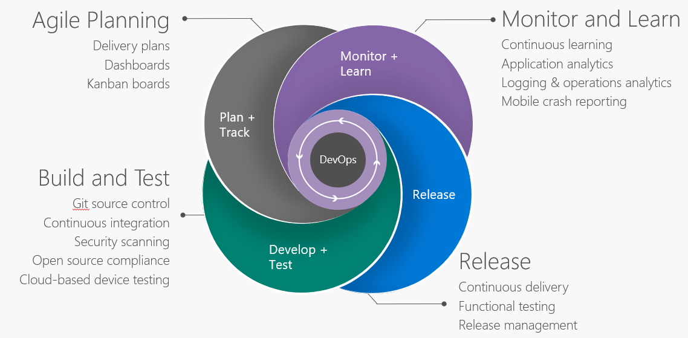
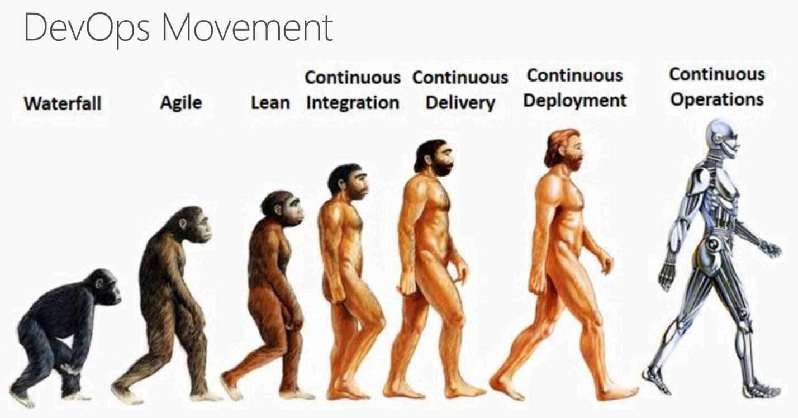
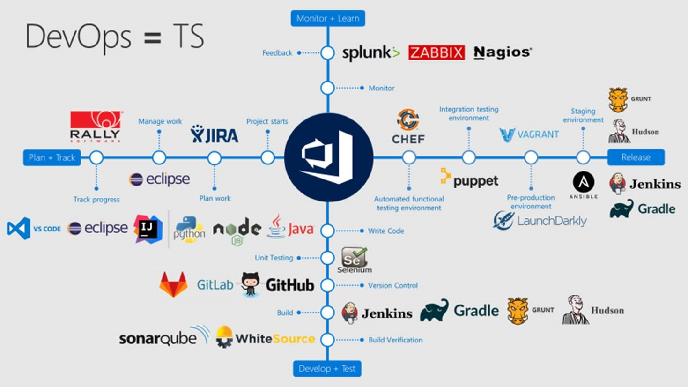

Previous lab: [Lab 5 - Decoupling with Microservices](../Lab%205%20-%20Decoupling%20with%20Microservices/README.md)

# Conclusion

## DevOps Lifecycle

## The DevOps Movement

## Assumptions about DevOps

- We all already do « some parts » of DevOps!
- It’s not magic
- Deliver often and fast with high value for end-user
- Evolution of current and existing practices
- It’s continuous learning
- It’s not a methodology
- It’s not only « Dev & Ops », many stakeholders are involved!

## Lessons learned

- Automate
- Start small
- Fail fast
- Solve a problem that really matters
- Don’t think too much: Do & Learn - Validate & Learn.
- Stay safe. You will make errors. Things will break.
- Don’t wait till you have enough time. You never will.
- Automate, again!

## Example of the Agile/DevOps move the VSTS team at Microsoft did

## Choose your tools!

## Further concepts

- Database management
- Security tests
- Chaos monkey and fault injection tests
- Social media feedback integration in backlog
- A/B Testing, prototyping
- Decoupling with Microservices: Serverless, Containers, etc.

## Resources

- [12-Factor App](https://12factor.net/)
- [Journey to Cloud Cadence](https://www.youtube.com/watch?v=Lprj_4Wpi2s)
- [VSTS: From Monolith to Cloud Service](https://www.youtube.com/watch?v=9frodP5xLxk)
- [Agile at Microsoft](https://www.youtube.com/watch?v=-LvCJpnNljU)
- [Windows - The largest Git repo on the planet](https://blogs.msdn.microsoft.com/bharry/2017/05/24/the-largest-git-repo-on-the-planet/)
- [DevOps Checklist](https://docs.microsoft.com/en-us/azure/architecture/checklist/dev-ops)
- [Visual Studio Team Services- Hands-on-Labs](https://almvm.azurewebsites.net/labs/vsts/)
- [DevOps with VSTS](https://alwaysupalwayson.blogspot.com/2017/04/devops-with-vsts.html)
- [Agile Tour Quebec city 2016 - Your DevOps journey starts with ALM!](https://alwaysupalwayson.blogspot.com/2016/11/agile-tour-quebec-city-2016-your-devops.html)