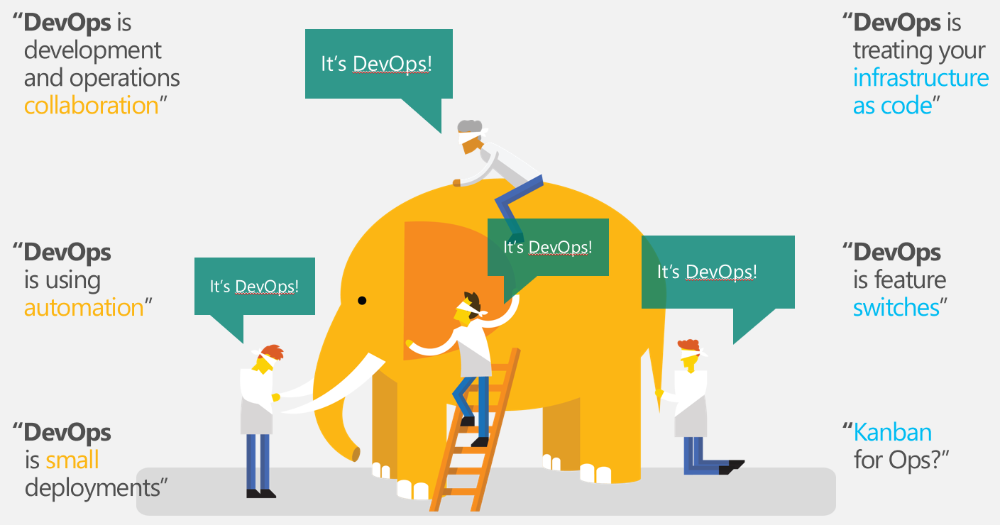
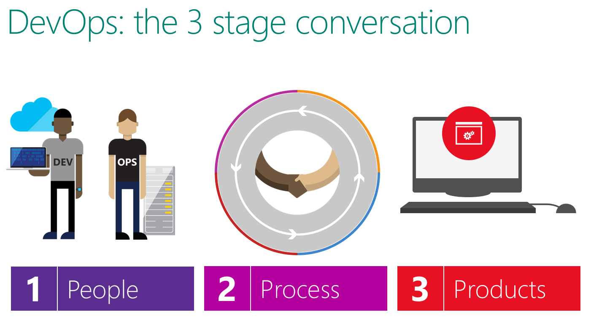
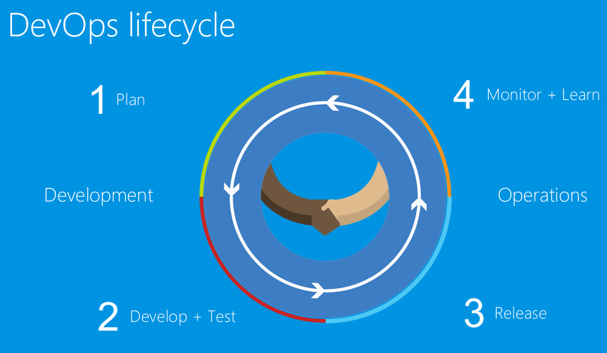
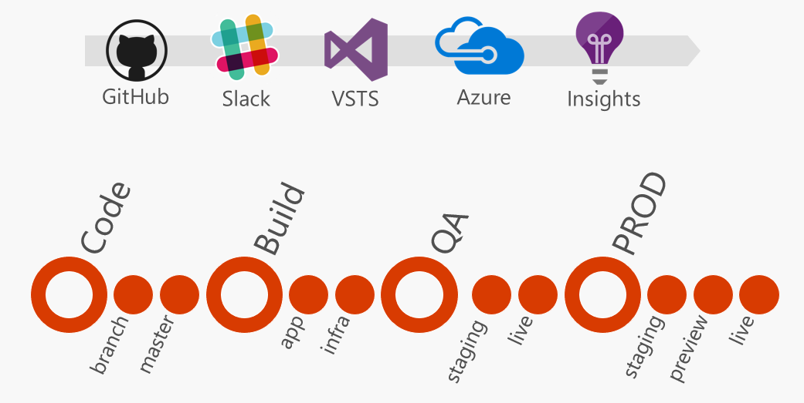

# Introduction

## What are DevOps?

Basic DevOps' tool chain:

- Code – Develop, Store, Merge, Distribute
- Build – Branch, Tag, Deploy
- Test – Feedback, Prove, Risk
- Package – Store, Stage, Distribute
- Release – Change Management, Approve
- Configure – Infrastructure as code, SDE
- Monitor – Visibility, End User Experience

How we measure success?

- Faster time to market
- Improved delivery frequency
- Decreased in release failure
- Decreased time for patch release
- Increased availability of resources
- Increased resiliency
- Increased resource manage  efficiency
- Increased customer satisfaction
- Dynamic and Secure

## Let's start the lab!

Start your lab: [Lab 1 - Source control](../Lab%201%20-%20Source%20control/README.md)