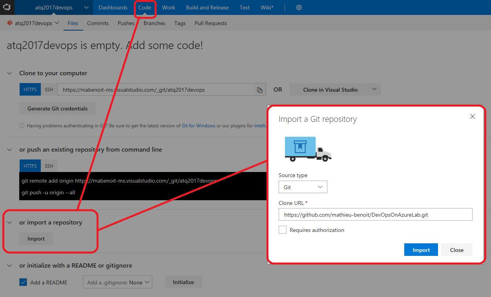
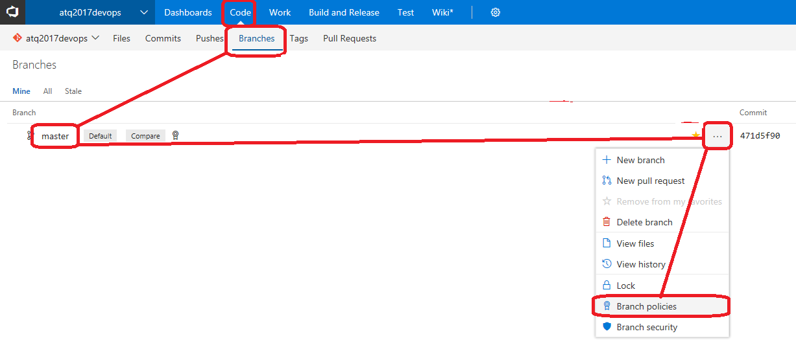
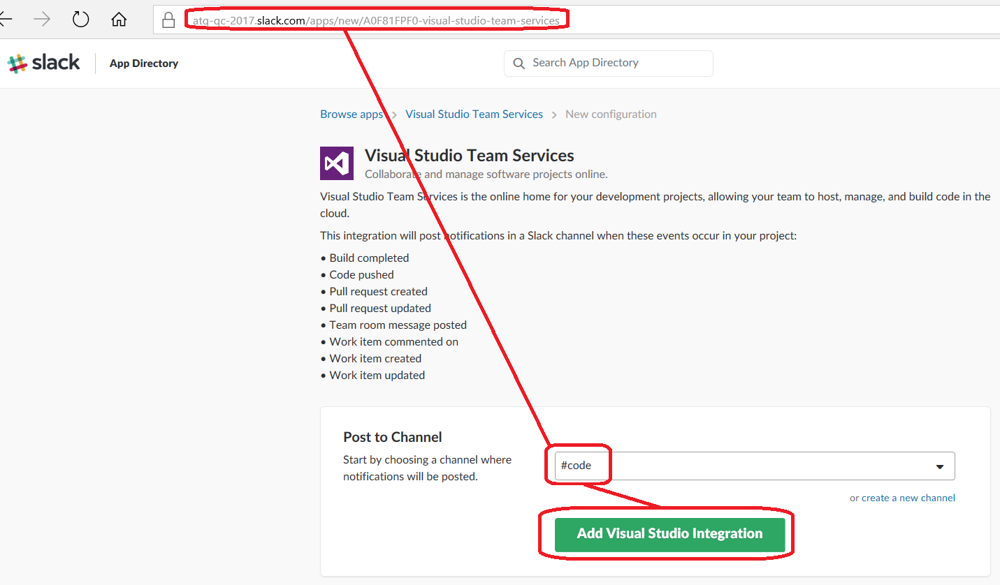
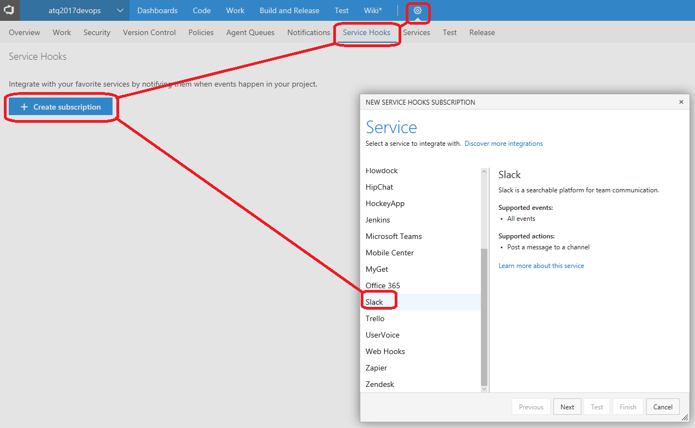
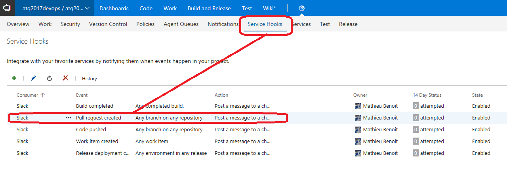

Previous lab: [Introduction](../Introduction)

# Lab 1 - Source control

Duration: 10 min

The goal of this lab is to setup a [Git source control with VSTS](https://docs.microsoft.com/en-us/vsts/git/overview) for a given application. You will go through 3 main sections in this lab:

- Import existing Git repository
- Setup branch policies
- Setup Slack notification for "Pull Request created"

Best practices highlighted:

- Use Git as decentralized source control
- Configuration of policies regarding branch, commit and pull request
- Automate the communication with your teammates through Slack notifications

## Import existing Git repository

1. Go to your VSTS account https://<yourvstsaccount.visualstudio.com
2. Navigate to the "Code" tab
3. Use the [Import into an existing empty repository](https://docs.microsoft.com/en-us/vsts/git/import-git-repository#import-into-an-existing-empty-repo) feature by hitting the "Import" button like illustrated on the image below.

4. Set the fields "Source type" to "Git" and "Clone URL" to `https://github.com/mathieu-benoit/DevOpsOnAzureLab.git` and click on "Import"

## Setup branch policies

5. Go to branch policies - TODO

6. Setup branch policies - TODO

## Setup Slack notification for "Pull Request created"

7. Ensure you are already logged in your Slack account for this lab - https://<youraccount>.slack.com
8. Go to this new app configuration link: https://atq-qc-2017.slack.com/apps/new/A0F81FPF0-visual-studio-team-services, select the "#code" channel and click on "Add Visual Studio Integration".

9. Once the result page is displayed ("New integration added!"), you will copy the "WebHook URL" field value "https://hooks.slack.com/services/..." to be used during the next steps. Scroll down at the bottom of this page to click on the "Save Integration" button.
10. Go to the "Service Hooks" of the "Admin" page of your VSTS project and from there click on the "Create subscription" button like illustrated below.

11. On the next pages, select "Pull request created" for the "Trigger on this type of event" and let the default "Filters", Then click on "Next" to paste there the "Slack Webhook URL" value "https://hooks.slack.com/services/..." you copied from the Slack configuration we did earlier. Finally, click on "Finish" to see the new associated Service Hook entry:

(Optional) You could repeat the actions to setup the Slack notifications for other actions from VSTS like for example: Build completed, Release deployment completed, Work item created, Code pushed, etc.

You are now all set for this lab. All these concepts will be used and illustrated with the next labs.

Next lab: [Lab 02 - Continuous integration](../Lab%2002%20-%20Continuous%20integration/README.md)