Previous lab: [Lab 1 - Source control](../Lab%201%20-%20Source%20control/README.md)

# Lab 2 - Continuous Integration

Duration: 45 min

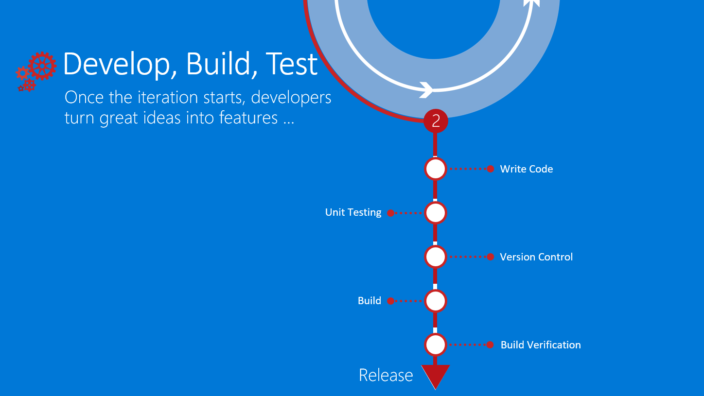

The goal of this lab is to configure the different steps of the Continuous Integration (CI) process for a given web app through a VSTS Build Definition. The basic concepts of a CI phase is to expose different artifacts which will be used during the next Continuous Delivery (CD) phase. You will finally trigger 2 builds to see what will happen: manually and auto-triggered by a commit. 

Best practices highlighted:

- Import Build Definition and Task Group from files ("as code") provided by the "Ops" team
- Integrate unit tests during the CI process
- Trigger CI at each commit into master branch
- Validate code on feature-branch by pre-merging and building PR changes
- Do code review through PR (comments, rejection, etc.)
- Create a work item on build failure as bug in the backlog
- Generate artifacts to be reused in a separate Continuous Delivery (CD) process
- Automate the communication with your teammates through Slack notifications

You will go through 4 main sections in this lab:

- Create/Import the VSTS Build definition and expose the "app" artifact
- Update the "master" branch policies to validate code by pre-merging and building PR changes
- Fix the unit test issue by submitting a new branch and pull request
- Import tasks group to expose the "infra" and "ui-tests" artifacts

## Create the VSTS Build definition and expose the "app" artifact

1. Go to your VSTS account `https://<yourvstsaccount.visualstudio.com` and open your VSTS project for this lab
2. Navigate to the "Build and Release" tab and click on the "Import" button on the top right hand corner to import the file below. Copy/paste this path into the "File name" field and then click on "Open" and finally "Import":

`
https://raw.githubusercontent.com/mathieu-benoit/DevOpsOnAzureLab/master/docs/Lab%202%20-%20Continuous%20Integration/CI-BuildDefinition.json
`

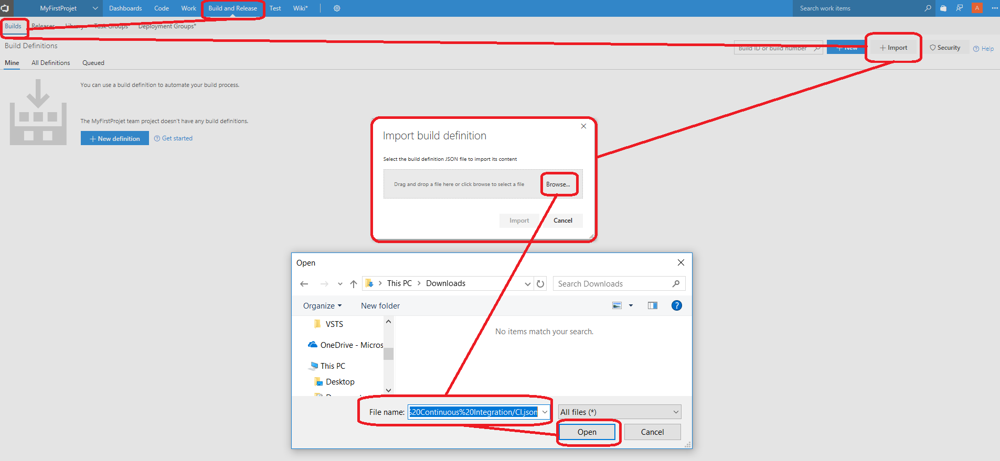

3. You will land on the "Tasks" tab of the Build definition imported where you will see the default tasks to build an ASP.NET Core web app and expose its associated package ready to be deployed. Here, just change the "Name" to `CI`:

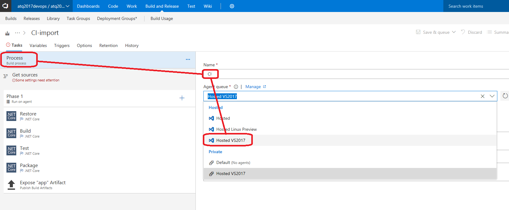

4. Navigate to the "Trigger" tab of this Build definition page and enable the "Trigger status" of the "Continuous Integration" section.

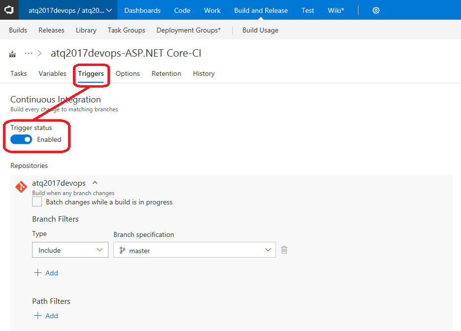

5. Navigate to the "Options" tab of this Build definition page and enable the "Create work item on failure" section.

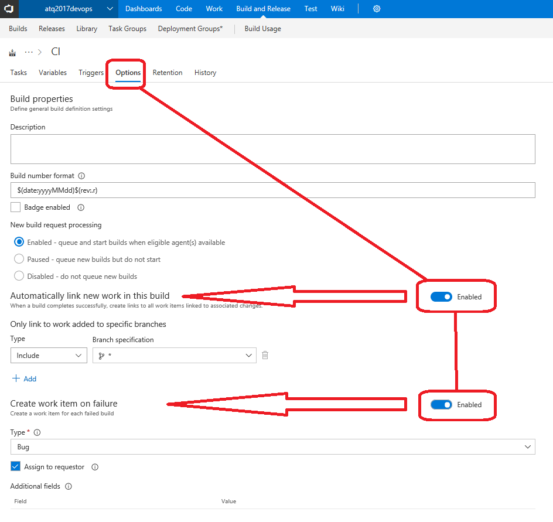

6. Then click on the "Save & queue" toolbar button. The "Save build definition and queue" will popup and just click on the "Save & queue" button.
7. After ~2 min this build should failed because of a unit test failure:

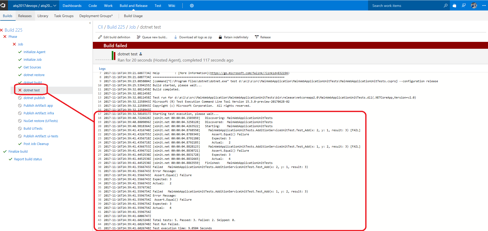

8. Here you should be able to see the different notifications related to this failure:

- In the current and default "Iteration 1" of the VSTS Work feature, you should see a new Bug Work Item just created.
- In Slack, you should see 2 notifications: 1 for the Build failed in the #build channel and 1 other for the Work Item created in the #work channel.

## Update the "master" branch policies to validate code by pre-merging and building PR changes

9. Now we have a build definition created, let's adjust the "master" branch policies to reinforce quality check while creating and managing new Pull Request on branches. For that, go to the "master" branch policies page (like you did with the [previous lab](../Lab%201%20-%20Source%20control/README.md)) and click on the "Add build policy" to then select the `CI` Build definition we just created. Click on "Save" on the pop-up and finally on the "Save changes" toolbar button of the "Policies" page:

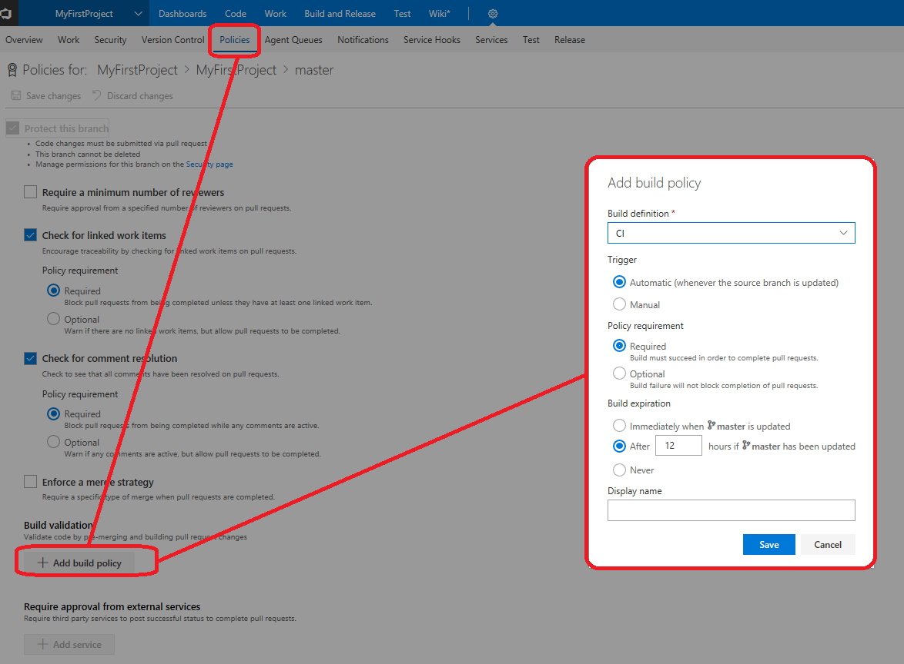

## Fix the unit test issue by submitting a new branch and pull request

10. Go to the VSTS "Work" main tab to create a new branch based on the master branch. Click on "New branch" action and name it as `fix-unit-test` and then click on the "Create branch" button:

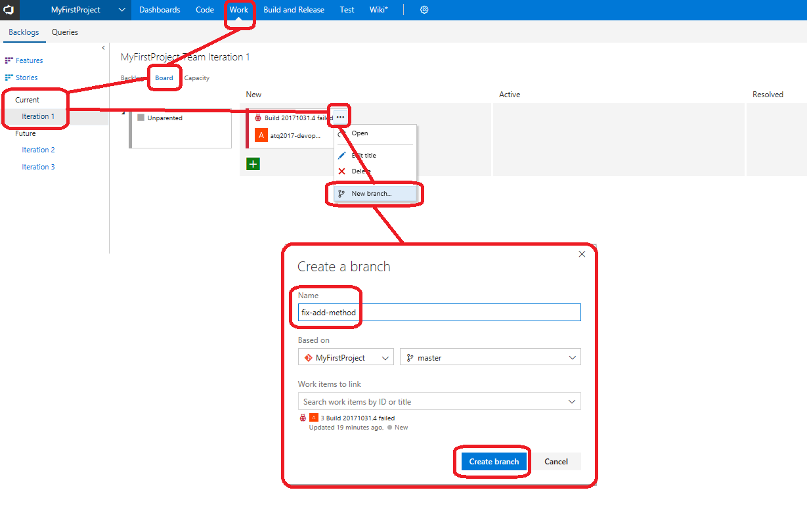

11. Navigate to the `src/MainWebApplication/MainWebApplicationUnitTests/SampleUnitTest.cs` file on this `fix-unit-test` branch. Click on the "Edit" button (top right hand corner) and then update the line 22 by replacing `return y + y;` by `return x + y;` (Yeah, big mistake! ;)). Click on the "Commit..." button (top right hand corner again) and on the "Commit" button once poped up.

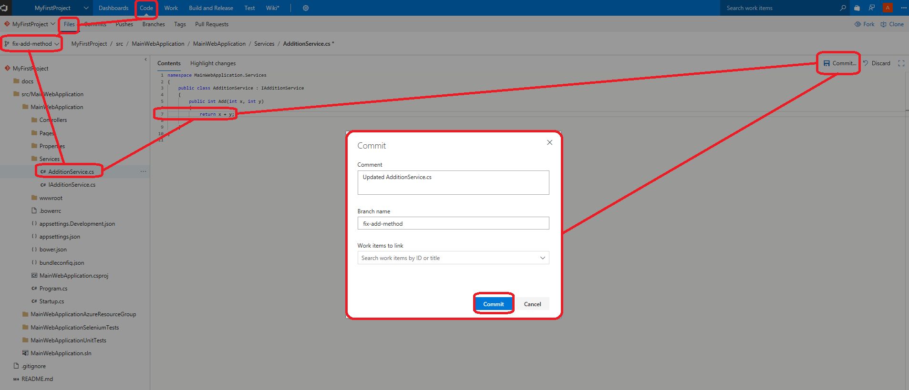

12. You will be invited to create a Pull Request based on this commit on this branch. Let's proceed to land on the create a Pull Request page:

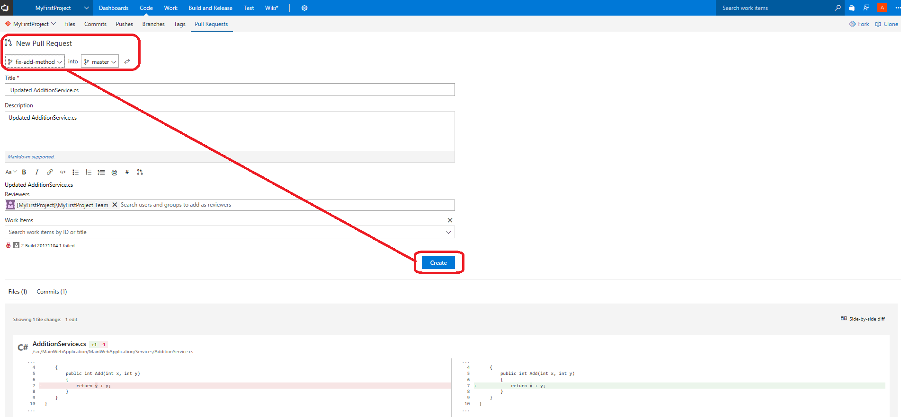

13. As a PR/code review, comment the line updated on the right hand side:

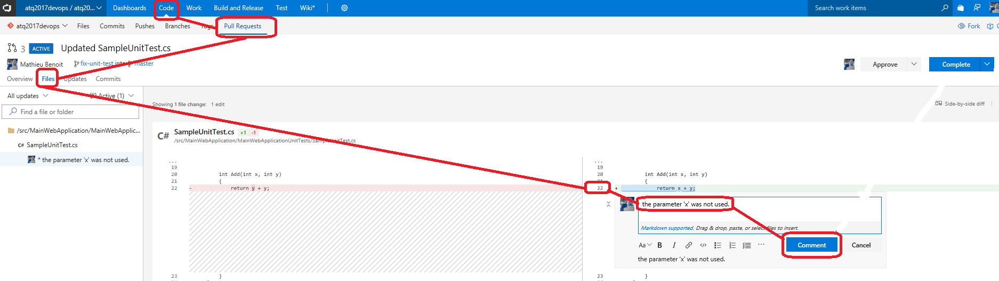

14. On the "Overview" tab of this PR you should see the status of the current policies: 1 Build should be in progress and "Not all comments resolved". By waiting the end of the current build, let's "Resolve" the comment:

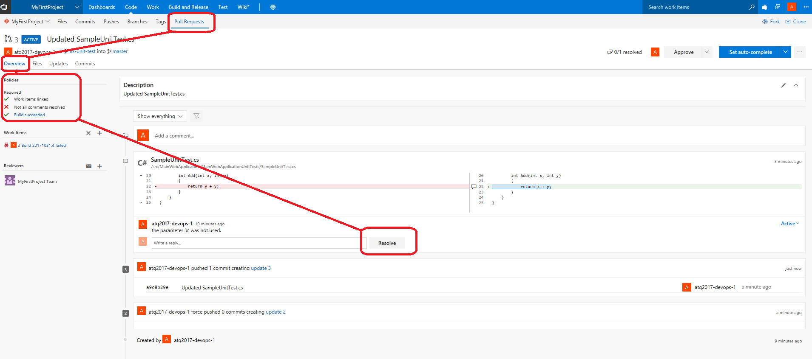

15. Once the Build is completed successfuly (you are supposing to resolve the unit test issue in this PR, the build should pass), you will be able to "Complete" this PR. A new build will be triggered after the merge into master, it should be completed successfuly. Furthermore, you should see new Slack notifications (Code pushed + Build completed).

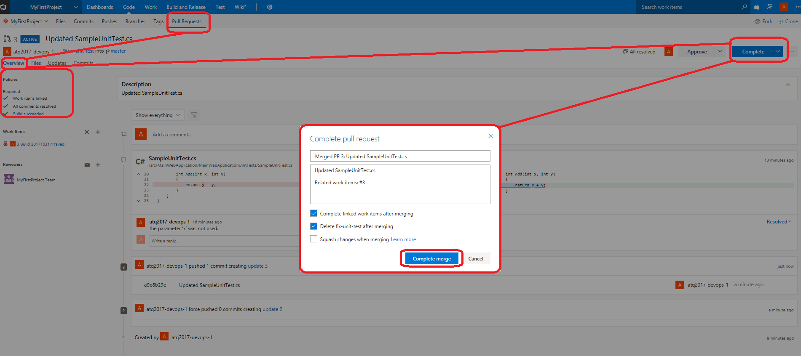

## Import tasks group to expose the "infra" and "ui-tests" artifacts

16. Navigate to the "Task Groups" sub-tab of the "Build and Release" tab and click on the "Import" button on the top left hand corner to import the file below. Copy/paste this path into the "File name" field and then click on "Open" and finally "Import":

`
https://raw.githubusercontent.com/mathieu-benoit/DevOpsOnAzureLab/master/docs/Lab%202%20-%20Continuous%20Integration/ExposeInfraAndUITestsArtifacts-TaskGroupDefinition.json
`

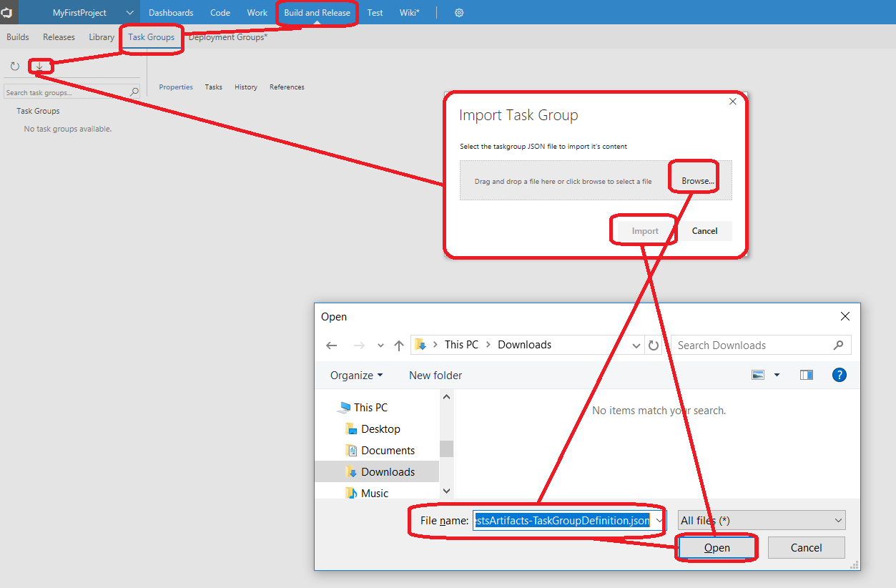

17. Once imported, just rename this Task Group as `ExposeInfraAndUITestsArtifacts` and you should see the 4 tasks preconfigured in it:

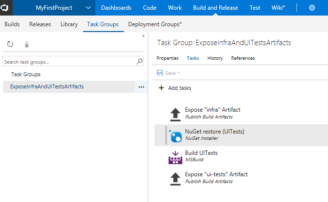

18. Go to the "Builds" sub-tab of the "Build and Release" tab, open your "CI" Build definition and add an instance of the Tasks Group just imported. Once added, let's rename this step as `Expose "infra" and "ui-tests Artifacts`:

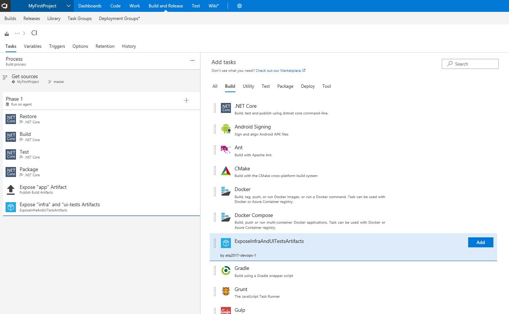

20. "Save and Queue" this build. Once it will be successfully completed you should see the 3 artifacts below and should see the Slack notifications as well:

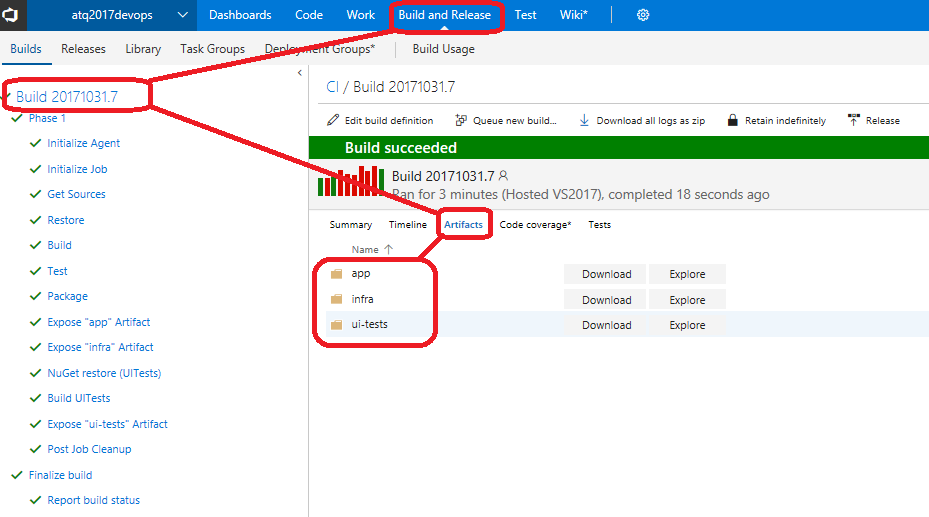

You are now all set for this lab. Let's see how the 3 artifacts of these CI will be used with the next lab during the CD process.

Next lab: [Lab 3 - Continuous Delivery](../Lab%203%20-%20Continuous%20Delivery/README.md)