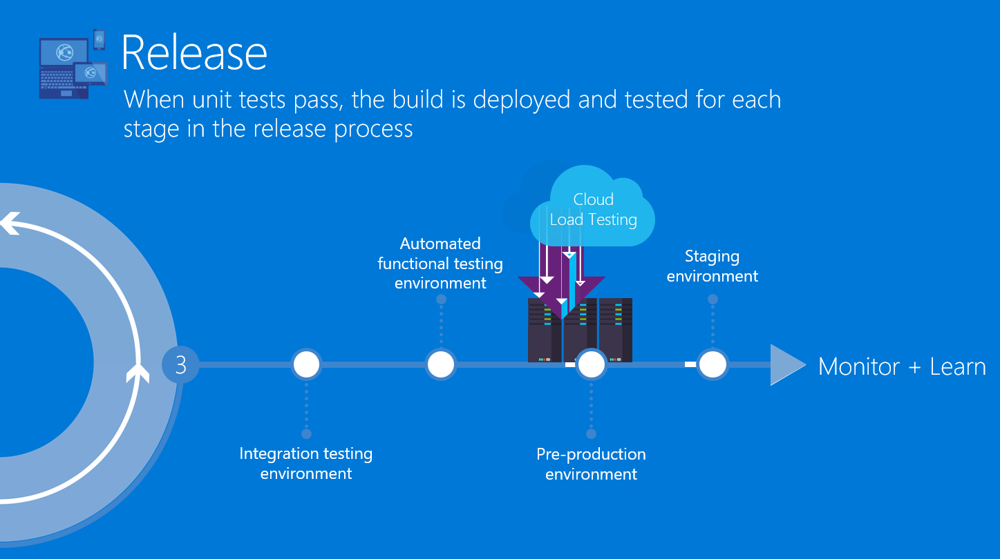

Previous lab: [Lab 2 - Continuous Integration](../Lab%202%20-%20Continuous%20Integration/README.md)

# Lab 3 - Continuous Delivery

Duration: 20 min

The goal of this lab is to ... 

Best practices highlighted:

- Use a dedicated version of the CI's artifacts (latest by default)
- Use Azure ARM Templates as Infrastructue-as-code
- Store settings on the server - defined in the ARM Templates
- Run UITests
- Auto-trigger the CD when the CI is completed
- Automate the communication with your teammates through Slack notifications

You will go through 4 main sections in this lab:

- Create a Release definition
- Deploy the infrastructure and the app
- Run the UITests
- Commit a fix in the UITests to trigger the pipeline: CI --> CD

## Create the Release definition to deploy the "app" artifact in DEV environment

TODO - Merge app, infra, ui test steps with an import of Tasks Group

- Choose an Azure App Service Deploy
  - Version 2.*
  - Environment: DEV 
  - Azure subscription: Azure Paas - Connection
  - App service name: $(DevAppServiceName)
  - Version: 2.*
  - Package or Folder: $(System.DefaultWorkingDirectory)/CI/app/MainWebApplication.zip
- Setup the variable DevAppServiceName
- Setup the artifact "CI" and enable the "Continuous deployment trigger" on the "master" branch
- Run manually the Release
--> It should failed, because... we don't have any infrastructure in place yet...

## Deploy the "infra" artifact

- Choose an Azure Resource Group Deployment
  - Azure subscription: Azure Paas - Connection
  - ResourceGroup: $(DevResourceGroup)
  - Location: $(Location)
  - Template: $(System.DefaultWorkingDirectory)/CI/infra/template.json
- Setup the variable ResourceGroup, Location

## Run the "ui-tests"

## Fix the "ui-tests" issue and trigger the entire pipeline from a commit

## Blue/Green deployment

TODO

## Rollback

TODO

## Separate environments QA versus PROD

TODO

## Cleanup DEV

- Create a new Environment named "Cleanup"
- Manual only
- Choose an Azure Resource Group Deployment
  - Azure subscription: Azure Paas - Connection
  - Action: Delete resource group
  - ResourceGroup: $(DevResourceGroup)

Next lab: [Lab 4 - Monitoring](../Lab%204%20-%20Monitoring/README.md)