Previous lab: [Lab 2 - Continuous Integration](../Lab%202%20-%20Continuous%20Integration/README.md)

# Lab 3 - Continuous Delivery

Duration: 25 min

The goal of this lab is to configure the different steps of the Continuous Delivery (CD) process for a given web app through a VSTS *Release Definition*. The basic concepts of the CD phase is to deploy the different artifacts exposed by the CI phase: deploy the `infra` artifact, then the `app` artifact to finally run the `ui-tests` artifact on the different environments: `DEV`, `QA`, etc. You will finally trigger the release to be able then to browse the web app endpoints deployed. 

Best practices highlighted:

- Import Release Definition ("as code") provided by the "Ops" team
- Use a dedicated version of the CI's artifacts (latest by default)
- Use Azure ARM Templates as Infrastructure-as-code exposed by the "Ops" team
- Store settings on the server - defined in the ARM Templates
- Run UITests (Selenium)
- Auto-trigger the CD when the associated CI is completed
- Deploy the web app on Azure App Service to take advantage of the Cloud infrastructure and its capabilities
- Protect infrastructure resources by adding restricted policies to control access and cost
- Automate the communication with your teammates through Slack notifications

You will go through 5 main sections in this lab:

- Configure the CheckUrl extension and the Azure Resource Manager service endpoint and import a pre-built Release definition
- Edit and customize the imported Release definition
- Let's explore the tasks/steps of these environments
- Approve manually the deployment from `QA-staging` to `QA`
- Browse the Azure resources

## Configure the CheckUrl extension and the Azure Resource Manager service endpoint and import a pre-built Release definition

*Note: For the Agile Tour Quebec 2017, skip this section and [go directly to the next section](#edit-and-customize-the-imported-release-definition). These steps have already been done for you to save some time for your lab, so just start by editing the `CD` Release definition.*

- Go to your VSTS account `https://<yourvstsaccount>.visualstudio.com` and open your VSTS project for this lab
- Install the CheckUrl extension - https://marketplace.visualstudio.com/items?itemName=saeidbabaei.checkUrl
- Configure an Azure Resource Manager endpoint for example with the name `Azure Pass - Connection`:

Note: after the creation of this endpoint an Azure user is created as `Contributor`. Azure Resource Group policies and lock will be applied later on this lab and because the `Contributor` role doesn't have write rights on `Microsoft.Authorization/locks/`, `Microsoft.Authorization/policydefinitions/` or `Microsoft.Authorization/policyassignments/`, so:
- either you add these rights to the associated user via the Azure portal;
- or you disable the 3 associated tasks in the `QA-staging` Environment.

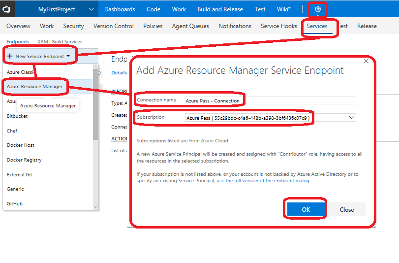

- Navigate to the **Build and Release** > **Release** tab
- Click on the **Import** button on the top left hand corner to import the file below. Copy/paste this path into the **File name** field and then click on **Open** and finally **Import**:

*Note: if you don't have any Release definition yet, you should create an empty Release definition first to have access to the import feature.*

`
https://raw.githubusercontent.com/mathieu-benoit/DevOpsOnAzureLab/master/docs/Lab%203%20-%20Continuous%20Delivery/CD.json
`

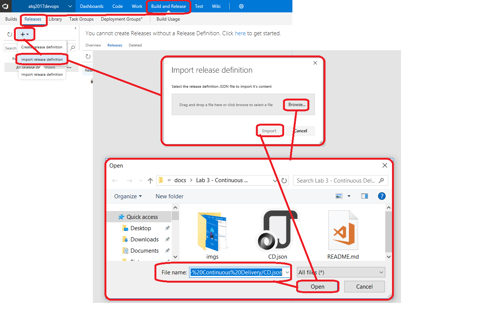

- After the import, rename the Release definition as `CD` and go to the **Tasks** tab of this Release definition and apply the actions below for each Environment: `DEV`, `QA-staging`, `QA`, `Rollback QA`, `Delete QA` and `Delete DEV`:
  - Set the **Agent queue** of the **Run on agent** step to `Hosted VS2017`
  - Set the **Azure subscription** of the first step **Deployment process** to `Azure Pass - Connection`

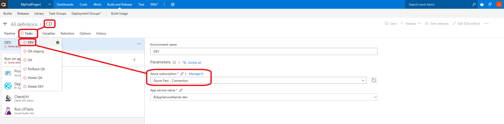

## Edit and customize the imported Release definition

0. Open a **new web browser instance in Incognito, Private or InPrivate mode** to avoid any signed-in session conflict.
1. Go to your VSTS account `https://<yourvstsaccount.visualstudio.com` and open your VSTS project for this lab. *For the Agile Tour Quebec 2017, checkout your sticker.*

2. Navigate to the **Build and Release** > **Release** tab and click on the **Edit** action:

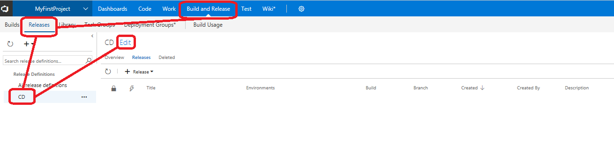

3. Go to the **Variables** tab of this Release definition and change the value of the `AppServiceName` variable to your correct and unique username, for example: `atq2017devops<YourName>`. **This name is required be unique** otherwise it will fail to deploy as an Azure Web App.

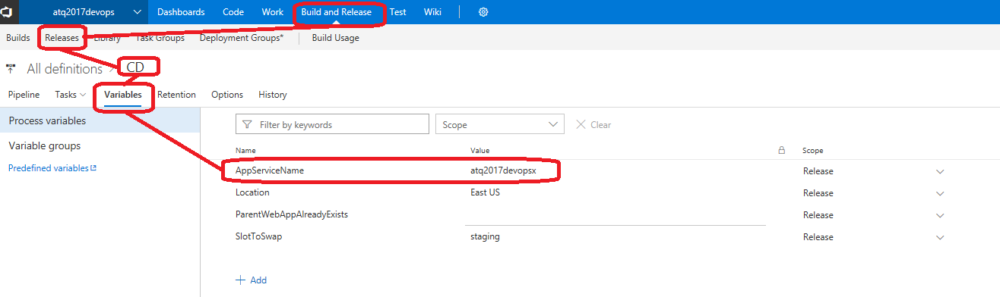

4. Go to the **Pipeline** tab of this Release definition and click on **Add artifact** on the left side of this screen:

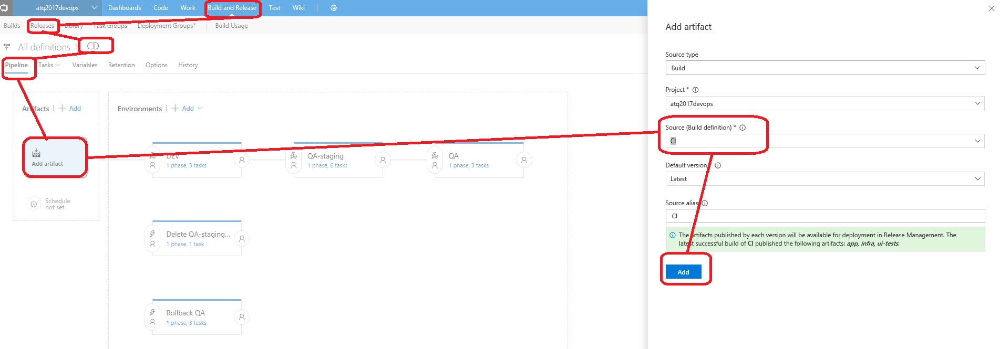

5. On this artifact let's enable the **Continuous deployment trigger** by selecting `master` as the **Build branch**:

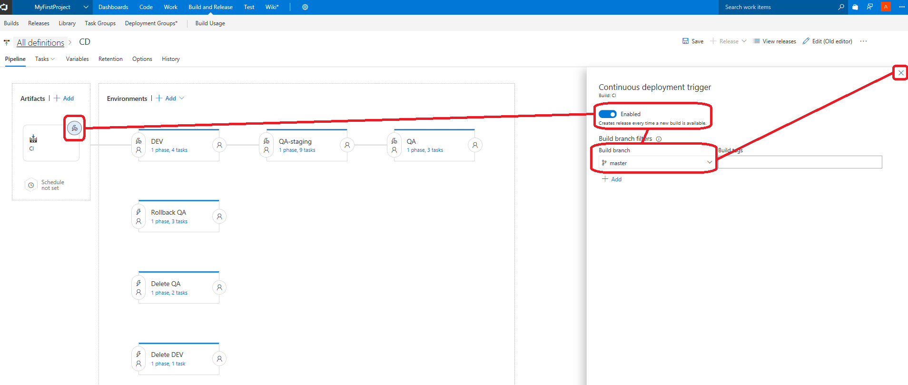

6. On the **QA** Environment, click on its left side to customize its **Pre-deployment conditions** and set yourself as **Pre-deployment approvers**:

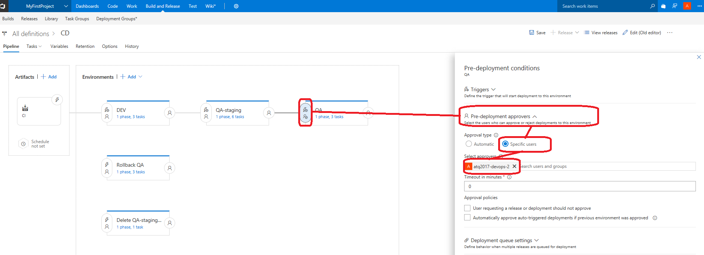

7. On the **Rollback QA** Environment do the exact same setup.

8. On the same **Pre-deployment conditions** setup page of the **Rollback QA** Environment, change the trigger type to `After environment` and select the `QA` Environment:

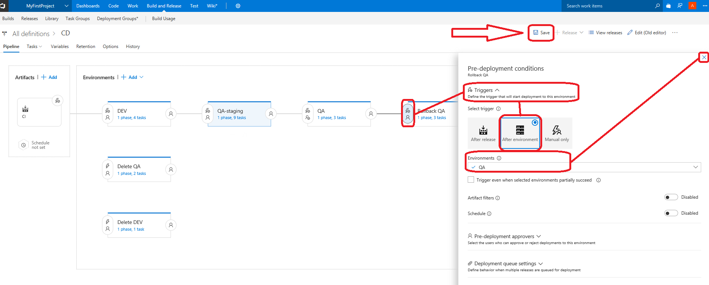

9. **Save** your changes and then let's manually trigger **Release** > **Create release** now we are ready:

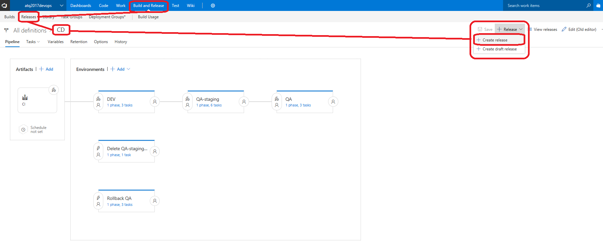

10. Leave the default information and just click on the **Create** button:

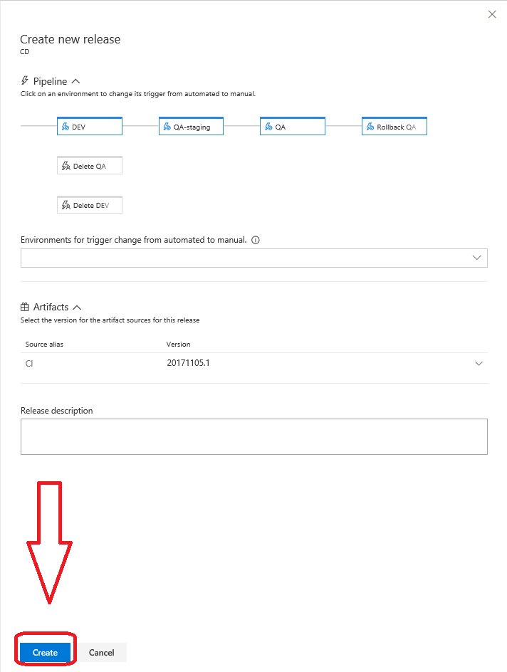

*Note: the duration of this release should take ~6 min. During this wait, go to the next section to explore the different tasks of this Release definition.*

## Let's explore the tasks/steps of these environments

11. DEV

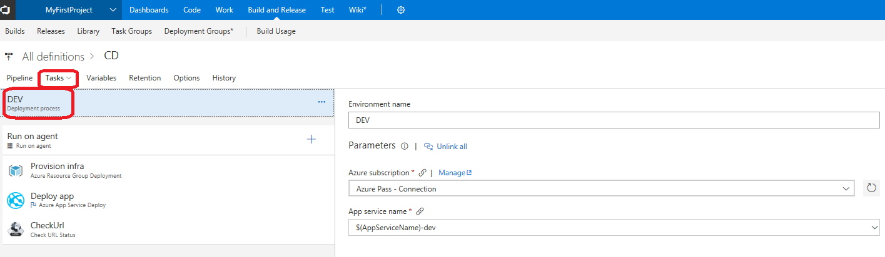

12. QA-Staging

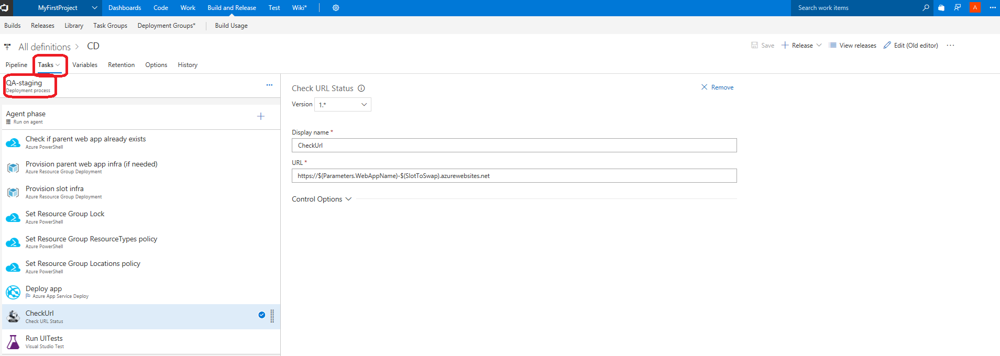

13. QA

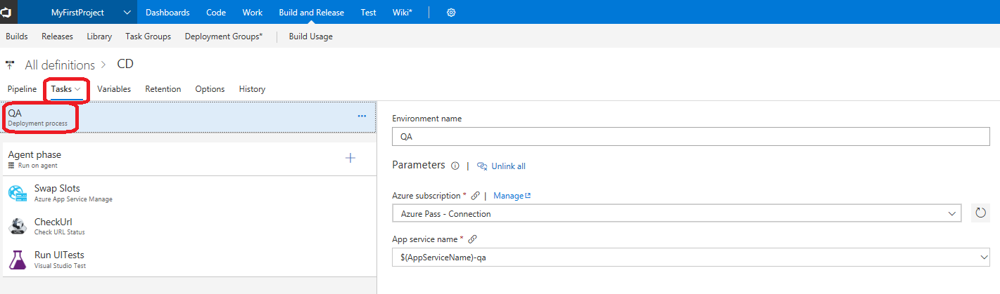

14. Rollback QA

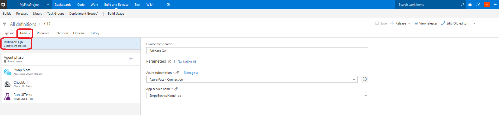

15. Delete QA

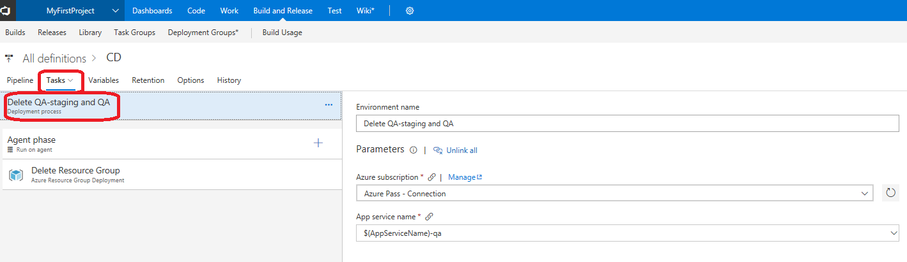

16. Delete DEV

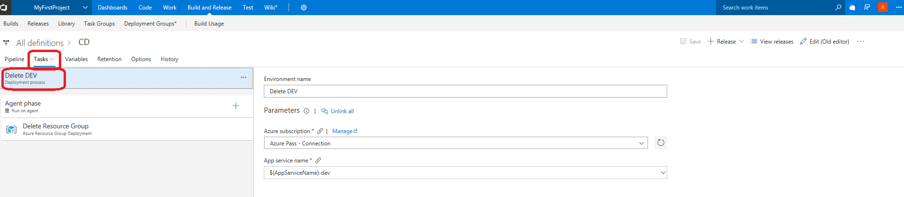

## Approve manually the deployment from "QA-staging" to "QA"

17. Navigate to **Build and Release** > **Release**, select your `CD` and double click on the latest Release executed (the one you manually triggered earlier):

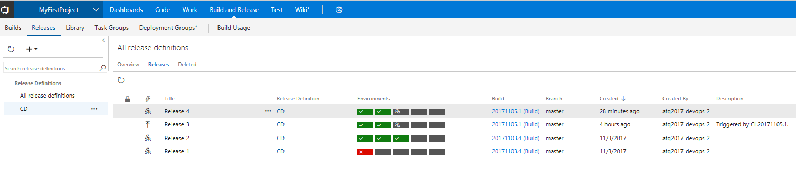

18. Once `DEV` and `QA-staging` are successfully deployed, you should be able to click on **Approve or Reject** and then **Approve** to deploy `QA`:

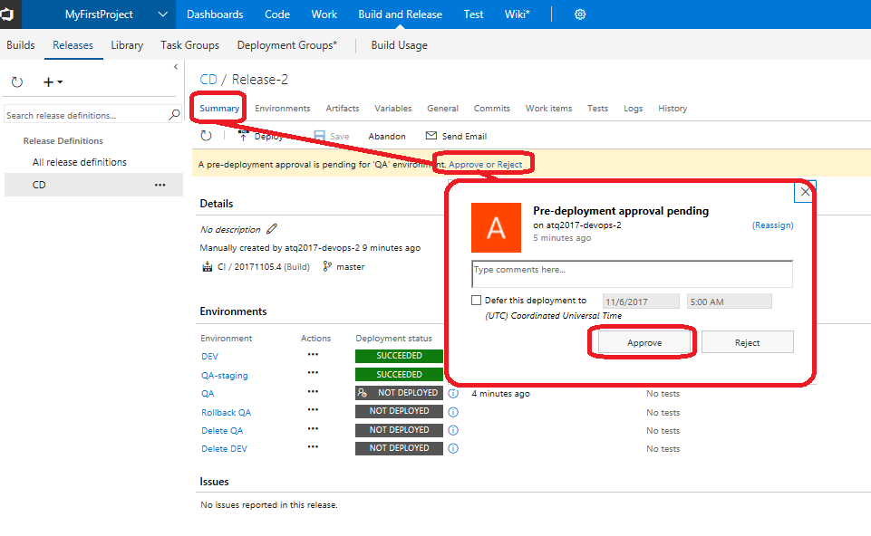

## Browse the Azure resources

19. Navigate to [https://portal.azure.com](https://portal.azure.com) where you should be able to see your Azure resources deployed:

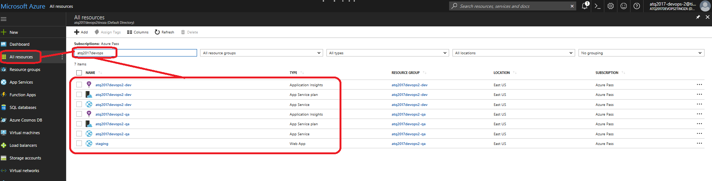

20. Navigate to the `QA` Azure Web App > **Overview** blade to see the homepage of the web app you have deployed on it (it will open a new web browser tab):

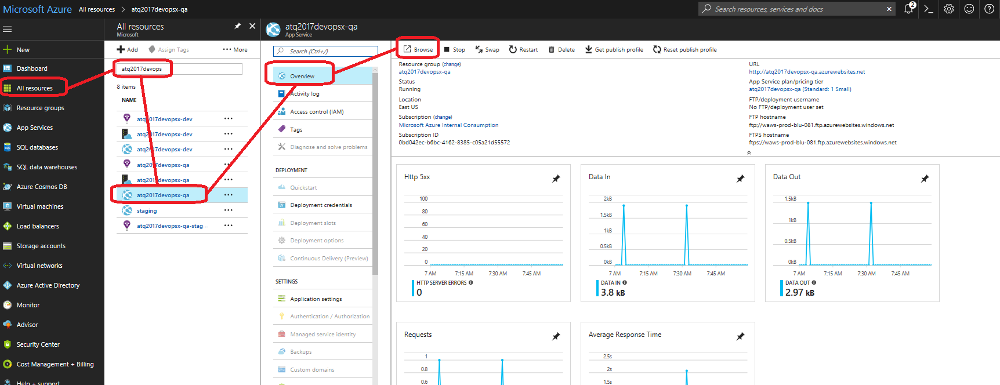

21. On your web browser tab just opened, you should land on the homepage. To generate some insights hit "F5" many times on the different pages: **Home**, **About** and **Contact**. 

22. Make sure you browse the **About** page, you should get an error (we will use that during the next lab):

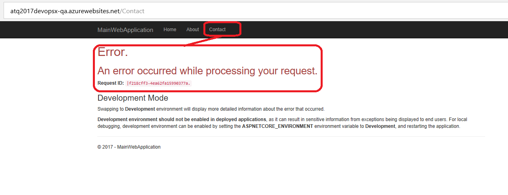

You are now all set for this lab. Let's now see what are the tools in place for the monitoring and learning pieces with the next lab.

Next lab: [Lab 4 - Monitor and Learn](../Lab%204%20-%20Monitor%20and%20Learn/README.md)