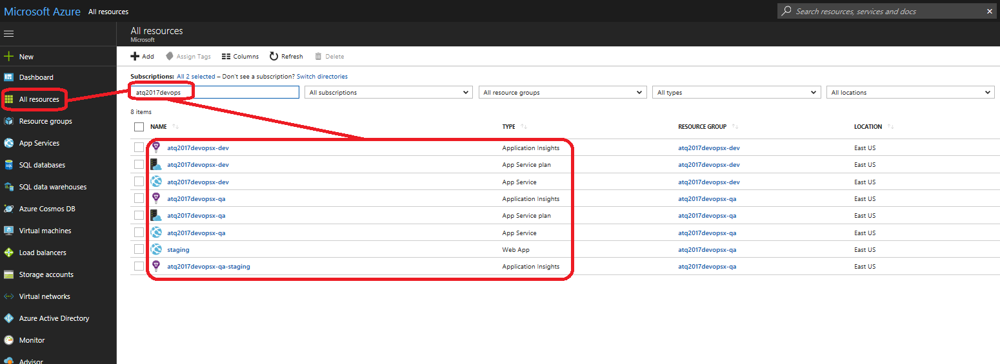
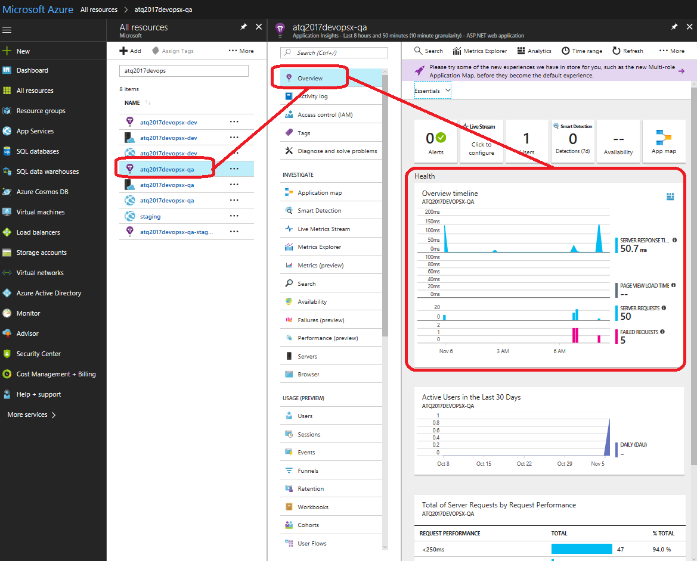
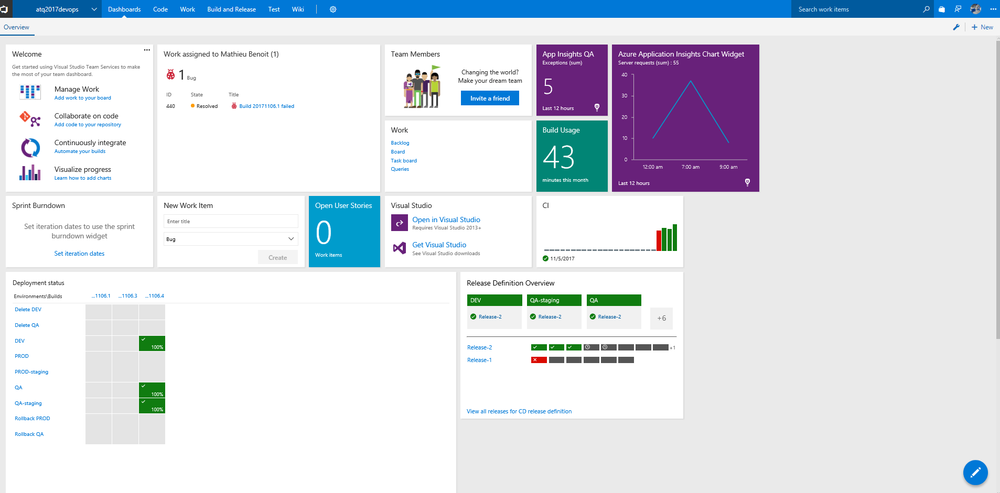

Previous lab: [Lab 3 - Continuous Delivery](../Lab%203%20-%20Continuous%20Delivery/README.md)

# Lab 4 - Monitor and Learn

Duration: 10 min

The goal of this lab is to discover the monitoring tools and the alert rules we have deployed throughout this lab and finally how to interact with the insights and how to display them. 

Best practices highlighted:

- Get actionable insights through application performance and instant analytics
- Get a dashboard to have an overview of some metrics regarding: VSTS Work/Build/Release and Application Insights
- Automate the communication with your teammates through Slack notifications

You will go through 3 main sections in this lab:

- Browse the alert rules previously provisionned
- Browse Azure Application Insights previously provisionned and linked your VSTS account on it to create an issue
- Customize your VSTS Dashboard

## Browse the alert rules previously provisionned

1. Navigate to [https://portal.azure.com](https://portal.azure.com) where you should be able to see your Azure resources deployed:

2. Navigate to the `QA` Azure Web App > **Alerts** blade to see what kind of alerts you provisioned earlier by deploying the ARM Template:

*Note: Not part of this lab, but other metrics could be configured and furthermore you could send email, SMS or setup a webhook to trigger some notifications, automations, etc.*

## Browse Azure Application Insights previously provisionned and linked your VSTS account on it to create an issue

3. Navigate to the `QA` Application Insights resource > **Overview** blade to see which metrics and insights you got:

4. Then navigate to its **Failures (preview)** blade and follow the flow exposed on the image below:

5. You will land to the **GET /Contact** failure/exception detail page, from there click on the **New Work Item** toolbar button to **Configure work item integration** with the values below by following the flow illustrated on the image below:
- Tracking System: `Visual Studio Team Serices`
- URL: *https://<youraccount>.visualstudio.com*
- Project: *yourproject*, for example: `MyFirstProject`
- Area: *yourarea*, for example: `MyFirstProject`

6. You will be then able to click again on the **New Work Item** toolbar button to populate your VSTS Backlog with this new bug.

*Note: Not part of this lab, but [Application Insights](https://azure.microsoft.com/en-us/services/application-insights/) has many other great features you could leverage and take advantage of. Furthermore, you could integrate Application Insights into OMS Log Analytics for more advanced and centralized monitoring and insights*

## Customize your VSTS Dashboard

7. Go to your VSTS account `https://<yourvstsaccount>.visualstudio.com` and open your VSTS project for this lab

8. Navigate to the **Dashboards** tab and click on the **Edit Dashboard** > **+** buttons at the bottom right hand corner:

9. On the **Add widget** panel, add the widgets below:
- Azure Application Insights Chart Widget
  - *If it's not installed, you will need to install the associated VSTS Marketplace extension [here](https://marketplace.visualstudio.com/items?itemName=ms-appinsights.ApplicationInsightsWidgets).*
- Azure Application Insights Metrics
  - *Same extension as above.*
- Build Usage
  - *If it's not installed, you will need to install the associated VSTS Marketplace extension [here](https://marketplace.visualstudio.com/items?itemName=ms-devlabs.BuildandTestUsage).*
- Chart for Build History
- Deployment status
- Pull Requests
- Release Definition Overview

10. After some configuration you could have a new dashboard like that:

You are now all set for this lab. Let's now wrap up what we have seen throughout this lab and discuss what's next for your DevOps journey.

Next lab: [Conclusion](../Conclusion/README.md)